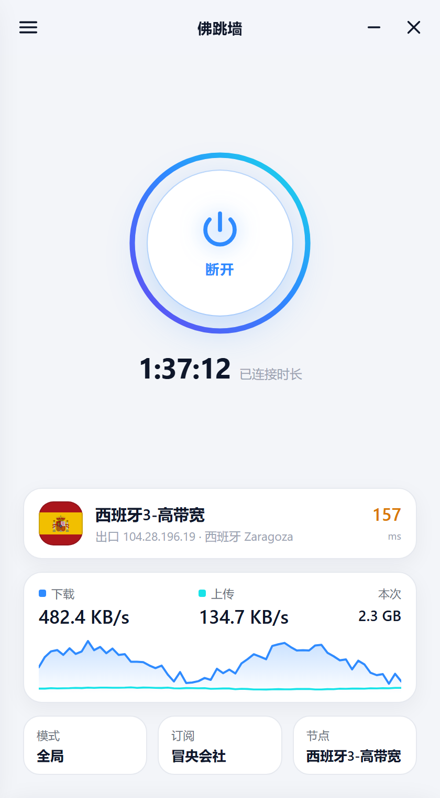
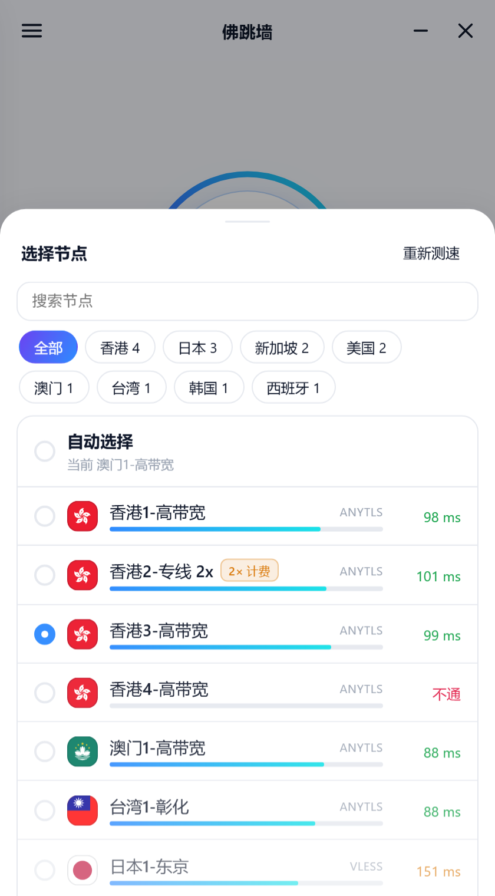
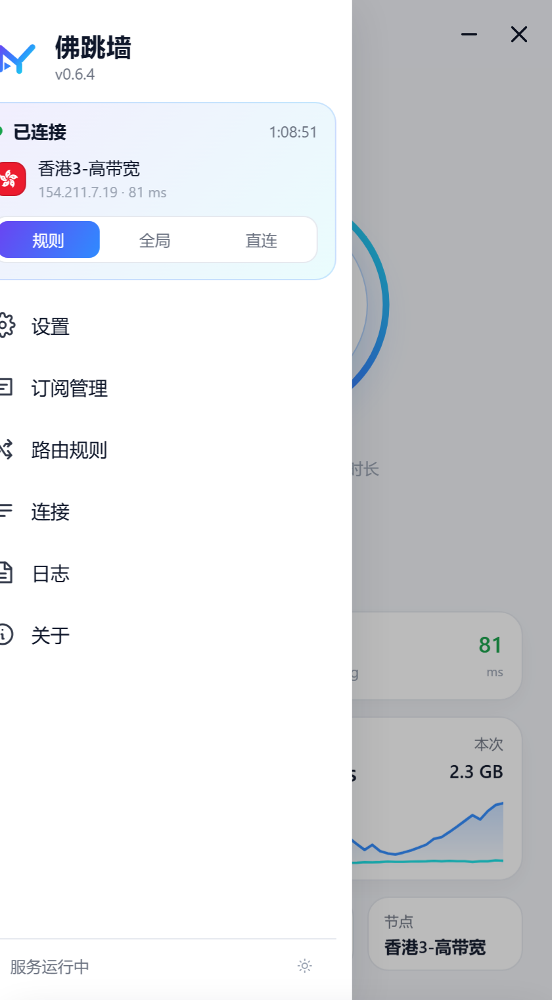

<p align="center"></p>
<h1 align="center">佛跳墙 · godusevpn</h1>
<p align="center"><a href="https://github.com/Maoyangui/m-ui">m-ui</a> 面板的客户端 · Windows / macOS / Linux / Android 四端一套界面 · 内嵌 <a href="https://github.com/SagerNet/sing-box">sing-box</a> · TUN 全机接管 · 默认关掉 IPv6</p>
<p align="center"><a href="https://maoyangui.github.io/godusevpn/">介绍站</a> · <a href="https://maoyangui.github.io/godusevpn/docs.html">文档</a> · <a href="https://maoyangui.github.io/godusevpn/demo/">在线演示</a> · <a href="https://github.com/Maoyangui/godusevpn/releases">下载</a> · <a href="#默认策略">默认策略</a></p>
<p align="center">
  <a href="https://github.com/Maoyangui/godusevpn/actions/workflows/build.yml"></a>
  <a href="https://github.com/Maoyangui/godusevpn/releases/latest"></a>
  <a href="LICENSE"></a>
</p>

---

**先看看再装?** [在线演示](https://maoyangui.github.io/godusevpn/demo/) 就是客户端里那一份界面跑在示例数据上:不用装、不连任何服务,连接、换节点、切模式、编规则都能点,刷新即恢复。

<p align="center">
  
  
  
</p>

## 这是什么

m-ui 面板的多平台客户端:内嵌 sing-box,TUN 模式,规则 / 全局 / 直连三态,DoH + fake-ip,默认禁 IPv6(v6 接进隧道再拒绝,并在连接期间停用各网卡的 IPv6 协议),开机自启;多订阅(刷新走"当前代理 → 自动选择 → 直连"回退链)、定时测速、可视化规则组、按进程 / 应用 / 设备直连、应用内升级、日志保留、诊断包。四端共用同一个守护进程和同一套界面(一份 HTML/JS/CSS,浅色深色跟随系统或手动切换)。

| 平台 | 状态 | 形态 |
|---|---|---|
| Windows 10 1809 及以上 / 11(x64、ARM64) | 可用 | 后台服务 + 托盘客户端(WebView2 窗口),安装包见 Releases |
| macOS 13 及以上(苹果芯片、英特尔芯片) | 可用 | launchd 服务 + .app 窗口,curl 一行装,免开发者证书 |
| Linux 桌面 / 服务器(systemd) | 可用 | 单一二进制,自带浏览器面板,一键安装脚本 |
| OpenWrt / iStoreOS 等软路由 | 可用(网关模式,容器实验室验证) | 同一二进制,procd 自启,ipk 包;局域网设备策略 |
| 梅林(Asuswrt-Merlin / Entware) | 开发中 | TProxy 模式,无真机待反馈 |
| Android 手机 / TV | 测试版(手机已真机验证;电视按真机反馈修过一轮,待复测) | WebView 承载同一套页面 + gomobile 引擎,VpnService 建隧道,按 ABI 分包的 APK。页面写法迁就老电视的 WebView(底线 Chrome 66),`web/compat_test.go` 把关 |

## 结构

| 进程 | 身份 | 职责 |
|---|---|---|
| `godusevpn-svc.exe` | Windows 服务(SYSTEM,自动启动) | 内核、订阅、配置生成与干跑、TUN / 路由 / DNS、控制管道、诊断包 |
| `godusevpn.exe` | 当前用户(登录自启) | 托盘与主窗口(Wails + WebView2) |
| `godusevpn-cli.exe` | 当前用户 | 排障与脚本:状态、连接、模式、节点、订阅、日志、诊断 |

服务与客户端之间走命名管道 `\.\pipe\godusevpn`,一行一个 JSON;服务的访问控制允许普通用户查询、启动和停止它,托盘"退出"因此不用提权。数据在 `%ProgramData%\godusevpn\`:
`settings.json`(设置)、`profiles\<id>.json`(各订阅缓存)、`config.json`(最近生成的配置)、`config.last-good.json`(最近一次成功启动的配置)、`cache.db`(fake-ip 与节点选择)、`rulesets\`(本地规则集)、`logs\`、`diag\`(诊断包)。客户端自己的偏好(语言、外观)在 `%APPDATA%\godusevpn\ui.json`。

## 构建

内嵌 sing-box 需要这几个构建标签:

```bash
go build -tags with_quic,with_utls,with_clash_api,with_gvisor -trimpath -ldflags "-s -w -X github.com/Maoyangui/godusevpn/internal/buildinfo.Version=0.3.0" ./cmd/godusevpn-svc
go build -trimpath -ldflags "-s -w" ./cmd/godusevpn-cli
go build -tags desktop,production -trimpath -ldflags "-s -w -H windowsgui" ./cmd/godusevpn
```

macOS 的图形界面要连 WebKit,得开 CGO,还得自己补上 Wails 没声明的 UniformTypeIdentifiers 框架;编好的二进制放进手工拼的 `.app`(模板在 `cmd/godusevpn/build/darwin/Info.plist`,图标用 `sips` + `iconutil` 现生成 icns):

```bash
CGO_ENABLED=1 CGO_LDFLAGS="-framework UniformTypeIdentifiers" go build -tags desktop,production -o godusevpn.app/Contents/MacOS/godusevpn ./cmd/godusevpn
```

或直接 `powershell -File build.ps1`,产物在 `dist\`(amd64 与 arm64)。图标、清单与版本信息由 `winres\*.json` 经 go-winres 生成到各 `cmd\*\rsrc_windows_*.syso`,CI 按 tag 重新生成。

图标:`go run ./tools/mkicons -logo cmd/godusevpn/build/logo.png -out cmd/godusevpn/build`。`logo.png` 是透明底的原图;生成的应用图标会垫一块白色圆角底(和安卓的自适应图标一致),原图的透明边会先裁掉再放上去;另出一张 `appicon-macos.png`(四周留透明边,macOS 的 Dock 图标用它做 icns);托盘图标保持透明。

测试:`go test -tags with_quic,with_utls,with_clash_api,with_gvisor ./...`(含内嵌 sing-box 对生成配置的干跑校验、管道往返、状态机全路径、设置迁移)。

## 安装与使用

从 [Releases](https://github.com/Maoyangui/godusevpn/releases) 下载。资产统一叫 `godusevpn-<版本>-<系统>-<架构>.<后缀>`,发布页里同一系统的包挨在一起,`SHA256SUMS` 是全部包的校验和:

| 系统 | 包 | 说明 |
|---|---|---|
| Windows x64 | `godusevpn-<版本>-windows-x64-setup.exe` | 标准版,缺 WebView2 时联网安装运行时 |
| Windows x64 | `godusevpn-<版本>-windows-x64-setup-offline.exe` | 离线完整版,内嵌 WebView2 运行时,给精简系统与内网机器 |
| Windows ARM64 | `godusevpn-<版本>-windows-arm64-setup.exe` | ARM64 设备 |
| Windows | `godusevpn-<版本>-windows-<架构>-bin.zip` | 三个裸 exe,手工替换与排障用 |
| macOS | `godusevpn-<版本>-macos-<架构>.tar.gz` | arm64(苹果芯片)/ amd64(英特尔),内含守护进程、`godusevpn.app` 与 `install.sh` |
| Linux | `godusevpn-<版本>-linux-<架构>.tar.gz` | amd64 / arm64 / armv7 / mipsle / mips,内含二进制与 `install.sh` |
| OpenWrt / iStoreOS | `godusevpn-<版本>-openwrt-<架构>.ipk` | `opkg install` 装完自动起服务并打印面板地址 |
| Android | `godusevpn-<版本>-android-<ABI>.apk` | arm64(绝大多数手机 / 电视)、armv7(老设备)、x86_64(模拟器 / 少数盒子)、universal(全架构合一) |

### Windows

**系统要求:Windows 10 1809(内部版本 17763)或更高,x64 / ARM64**。安装包会拦住更低的版本。Windows 7 / 8 用不了,而且不打算支持:Go 从 1.21 起就不再支持它们(内嵌的 sing-box 需要更高的 Go),微软也已停止为它们提供 WebView2。

安装包会注册后台服务(自动启动)、装托盘客户端与命令行,可勾选"登录时自动启动",并注册 `godusevpn://` 协议供落地页一键导入(客户端每次启动也会自己确认一遍这个协议,老版本升上来不用重装)。程序未签名,SmartScreen 提示时点"更多信息 → 仍要运行"。

- **首次打开**先填面板给的订阅链接才能进入。
> 地区是从节点名里认出来的:旗帜 emoji、中英文地名、独立的两位国家代码都认,认不出就画一个地球,不影响使用。旗帜是内置的 SVG(见 web/dist/flags/),不靠系统的 emoji 字体——Windows 至今没有旗帜字体。

- **首页**中间是连接 / 断开的大按钮,连上之后按钮下面用大字走连接时长;再往下两张卡片:
  - **出口卡片**:地区旗帜 + 当前节点 + 这条线路真正的出口地址与国家、城市 + 延迟,点一下直接换节点。出口是**经当前节点**查来的:节点名写的是机房位置,真正的出口未必在那儿(节点自己再套一层就不是了)。先问 `ipwho.is`(免密钥,一次 JSON 给地址 / 国家 / 一级行政区 / 城市 / 运营商),不通就退到 Cloudflare 自家的 `cdn-cgi/trace`(只给地址与国家代码,但几乎不会连不上);两个都不通就显示正在查出口,下一轮健康检查再来一次。两个端点回的都是对方看到的你是谁,不需要再拿这个 IP 去别处查一次归属地;请求走隧道,对方看到的是节点的出口地址,不是本机的。换节点立刻重测,自动选择模式下内核在后台切了也会重测,此外每 10 分钟复查一次。
  - **速度卡片**:实时上下行、本次连接累计流量,底下是最近一分钟的速度曲线。
  最下面三格:模式(规则 / 全局 / 直连)、订阅(多订阅点击切换)、节点。
- **节点面板**:每行带地区旗帜与延迟条,名字里写了倍率(`2x` / `x2` / `0.5倍`)会单独标出来;顶上按地区归堆成一排标签,点一下只看该地区,配合搜索框找节点。测速只改数字不重画列表,不会闪。
- **首次打开**是一张引导页:只要一个订阅链接,旁边带粘贴键;下面写清楚也可以在落地页点「一键导入」,以及订阅地址只存在本机。
- **订阅管理**:当前那条摊成一张大卡 —— 用量条、已用 / 总量、节点数与地区数、到期日,底下三个动作(刷新 / 编辑 / 删除);其余订阅各是一张小卡,点整行切换,底下同样是使用 / 刷新 / 编辑 / 删除。面板设置了「选购 / 续费」地址的,卡上会多一颗**续费**按钮,点开系统浏览器;快到期或流量快用尽时它变成橙色并写明还剩几天;已经到期、甚至到期后订阅已经拉不到了,按钮照样在(面板会把地址随那个 404 一起给)。
- **连接**页顶上三个数(活动 / 经代理 / 直连)+ 三个筛选标签,每行是目标、走的哪个节点、协议与时长、上下行,右侧一个叉断开这一条。列表**就地更新**,两秒一轮不会闪。
- **日志**页黑底等宽,时间 / 级别 / 正文三列对齐,警告与错误带底色;可以只看错误、暂停、复制全部,底下是导出诊断包。
- **关于**页居中放版本,有新版时那张卡整块点亮;下面是服务状态与修复、内核信息,以及诊断包、项目主页、退出三行。
- **左上角菜单**:顶上一张状态卡(连接状态、时长、当前节点与出口、三种模式就地切换),下面是设置、订阅管理(新增 / 编辑 / 删除 / 刷新 / 续费)、路由规则、连接(活动连接与断开)、日志(服务与内核、导出诊断包)、关于(检查更新、修复服务、退出);底部一颗小按钮在"跟随系统 / 浅色 / 深色"之间循环。
- **路由规则**:内置一组默认规则(局域网与私网直连、国内域名与 IP 直连、其余走代理),这三项各自可改(直连 / 代理 / 拒绝;"其余流量"只能选代理或直连),改乱了点"还原默认"一步回出厂。用户还可以可视化新增规则组:名称、出口(代理 / 直连 / 拒绝 / 自动选择 / 某个节点)、任意多条条件(域名后缀、完整域名、关键词、正则、IP 段、端口、进程名、geosite 类别、geoip 国家),组内任一条件命中即算命中;规则组自上而下依次匹配,排在默认规则之前,只在"规则"模式下生效,可启停、排序、编辑、删除。
- **刷新订阅不断线**:刷新拿到的增删立刻反映在节点列表里,正在用的连接一点不动,不用点什么"应用"。列表里刚加进来的节点(内核还没有)或参数改了的节点,选中时会重建配置重连一次。只有正在用的那个节点被面板删掉或改了参数才自动重连。
- **全局禁直连**(默认开):全局模式下只要还连着,任何流量都不许绕过隧道直连 —— 隧道没起来、内核在重启、节点不通、崩了在重试,统统只能等,不漏。放行的只有隧道自己(节点连接、订阅刷新的回退)、回环,以及「局域网直通」开着时的局域网。闸是持久的,服务被杀、崩溃、重启机器都还在,只有断开 / 切模式 / 关开关 / 卸载才撤;Windows 用系统过滤平台的持久规则,macOS 用 pf,Linux 用 nftables,Android 靠内核重启时不关 VPN 接口。断网了要恢复,托盘 / 开始菜单都有「恢复网络」,详见下文。
- **关窗口**只收到托盘,连接不断;托盘"退出"会断开连接并停掉后台服务,TUN 网卡随之消失。
- **订阅刷新回退**:经当前代理刷新失败时,改用"自动选择"组再试几次,仍失败就直连刷新。回退只作用于订阅刷新这一条请求,选中的节点和其它流量的路由都不受影响。
- **定时测速**:设置里的"定时测速(分钟)",自动选择时每隔该周期测一轮全部节点并切到最快的;手动指定节点时不测。这个间隔不写进内核配置(由守护进程定时叫测),所以自动 / 手动之间切换、改这个间隔都是就地生效,不重连。
- **按进程直连**:设置 → 分流,每行一个 exe 名(如 `steam.exe`),这些程序的流量不走代理。「全局禁直连」生效时(全局模式)不生效,这些程序也走隧道。
- **升级**:关于 → 检查更新 → 升级并重启;只替换程序,设置与订阅都保留。
- **日志保留**:默认 7 天,超过的滚动日志与诊断包自动删除;设置 → 日志里可改,0 = 一直保留。

## macOS

**系统要求:macOS 13(Ventura)或更高**,苹果芯片与英特尔芯片各有一个包(Go 1.27 编出来的程序就是 13 起步)。要管理员密码:

```bash
curl -fsSL https://raw.githubusercontent.com/Maoyangui/godusevpn/master/deploy/macos-install.sh | sudo sh
```

也可以自己下 `godusevpn-<版本>-macos-<架构>.tar.gz`,解开后 `sudo sh install.sh`。

**为什么用 curl 装**:Gatekeeper 的"来自互联网"隔离标记是浏览器下载时打上的,curl 拿到的文件没有这个标记,所以不用买苹果开发者证书,也不用你去"系统设置 → 隐私与安全性"里点允许。要是已经用浏览器下过包,`install.sh` 会顺手把标记清掉。

装完是两样东西:`/usr/local/bin/godusevpn` 是守护进程兼命令行,注册成 launchd 服务(`/Library/LaunchDaemons/com.maoyangui.godusevpn.plist`)开机自启;`/Applications/godusevpn.app` 是图形界面,启动台里叫「佛跳墙」,页面与 Windows / Linux 是同一套。

- 数据在 `/Library/Application Support/godusevpn/`(设置、订阅缓存、`config.json`、日志、诊断包),界面偏好在 `~/Library/Application Support/godusevpn/ui.json`。
- 隧道网卡是系统分配的 `utunN`(macOS 只认这个名字),**协议栈固定 gvisor** —— 系统协议栈在 macOS 上握不了手(内核收不到入站 TCP),设置页因此只给 gvisor 一个选项。
- **DNS 会被接管**:连上时把各网络服务的 DNS 改成一个走隧道的地址,断开时按连接前的原值还原(守护进程启动时也会还原一次,崩溃过也不会留下打不开网页的机器 —— 除非上次是在严格全局模式下连着的:那时先保留接管、等闸和隧道重建,否则那几十秒的解析会走物理网卡)。不这么做的话 macOS 一直问路由器(192.168.x.1),而私网段按"局域网直通"在隧道之外,解析记录就泄漏给本地网络了,fake-ip 与 AAAA 屏蔽也一并失效。
- 这一版**没有菜单栏图标**:Wails 与 systray 都要占着 Cocoa 主线程,凑一起要走外部事件循环,没有真机盯着调不准。所以关掉窗口只是关界面,隧道在后台服务里照常跑,从启动台再打开就回来了。
- 一键导入:落地页的 `godusevpn://` 由 `.app` 的 Info.plist 向系统登记,点一下直接把订阅交给客户端。
- 升级:关于 → 检查更新 → 升级并重启,弹一次系统的管理员密码框,守护进程与 `.app` 一起换掉。
- 卸载:`sudo godusevpn uninstall` 撤掉服务,再删 `/Applications/godusevpn.app` 与 `/usr/local/bin/godusevpn`。
- 验收:`sudo sh deploy/macos-test.sh <订阅地址>` 共 53 项;CI 每次提交都在 GitHub 的苹果芯片跑机上真跑一遍(装服务、拉订阅、建隧道、按规则跑流量、查 IPv6 是不是真被拦住且没绕过隧道、逐个调各功能页面的接口),另加一步把 `.app` 装进 `/Applications` 打开看它能不能活下来。

## Linux(桌面发行版 / 软路由)

同一套守护进程与页面跑在 Linux 上,一个静态二进制 `godusevpn` 既是服务也是命令行,自带浏览器面板(纯 HTTP)。root 执行:

```bash
curl -fsSL https://raw.githubusercontent.com/Maoyangui/godusevpn/master/deploy/install.sh | sh
```

装完终端会打印面板地址(局域网 / 内网地址、云主机的公网地址、本机地址)和随机生成的初始密码。Linux 上面板默认监听 `0.0.0.0:9800`,局域网其它设备直接打开即可;云主机要在安全组 / 防火墙放行 TCP 9800。改密码 `godusevpn passwd`,只给本机看就 `godusevpn settings webListen=127.0.0.1:9800`。面板与 Windows 客户端是同一套页面,功能一致(订阅、三态、规则组、节点测速、日志、升级)。

- 数据布局与 Windows 一致:设置在 `/etc/godusevpn/`,缓存、规则集、日志在 `/var/lib/godusevpn/`(梅林等 Entware 环境在 `/opt/etc` 与 `/opt/var/lib` 下)。
- 自启按初始化系统落地:systemd 单元、OpenWrt 的 procd 脚本、Entware 的 init.d 脚本;`godusevpn install | uninstall | start | stop | status`。
- 本机模式(默认):TUN 只代理本机流量,与 Windows 相同;连上后会给每个物理网卡地址加一条"回包走主表"的策略路由,远程 SSH 不会被切断。
- 网关模式(OpenWrt / iStoreOS 等软路由):设置 → 网络 → 网络模式选"网关"(或 `godusevpn settings netMode=gateway`),局域网设备把网关和 DNS 指向这台机器即被代理,设备的 DNS 查询由内核接管(fake-ip、防泄漏)。菜单里多出"设备"页:自动发现在线设备(DHCP 租约 + 邻居表),每台可设跟随规则 / 强制代理 / 直连 / 拒绝上网,按 MAC 记住;命令行 `godusevpn devices`、`godusevpn device <MAC> <follow|proxy|direct|reject> [名字]`。需要内核带 nftables(OpenWrt 22.03 起的 fw4 都有)。「全局禁直连」生效时(全局模式),设备的「直连」不生效,照样走隧道。
- 验收脚本 `deploy/linux-test.sh`,与 Windows 的检查项相同;网关模式在 Docker 里的 OpenWrt 23.05 + 一台 LAN 容器上验证过(设备被代理、fake-ip、IPv6 屏蔽、三种设备策略)。

## Android(手机 / 电视)

测试版:手机上已经真机跑通(连接、分流、断开、升级),电视端目前只在模拟器上验证过;欢迎反馈。

- **安装**:侧载 `godusevpn-<版本>-android-<ABI>.apk`(手机与电视基本都是 arm64;不确定就装 universal),首次安装要允许"未知来源"。最低 Android 8.0。
- **同一套界面与功能**:守护进程(设置、多订阅与刷新回退链、规则组、状态机、定时测速)和页面与 Windows / Linux 是同一份代码,数据布局也一样(`settings.json`、`profiles/`、`config.json`、`logs/`),只是放在应用私有目录。
- **隧道**:第一次点"连接"会弹系统的 VPN 授权;之后 VpnService 按引擎给的参数建隧道(地址、路由、DNS、按应用直连),通知栏常驻状态并带"断开"。应用自身**不**排除在隧道之外(排除了的话本应用套接字的回包会从物理网卡漏走,真机实测 DNS 通、TCP 全断);内核自己连节点的套接字经 protect 不进 VPN。
- **按应用直连**:Windows 的"按进程直连"在 Android 上就是应用包名(设置 → 分流),这些应用整个绕过 VPN。「全局禁直连」生效时(全局模式)不生效,这些应用也走 VPN。
- **开机自启**:引擎按上次状态自动连;Android 12 起后台起前台服务受限,开机与升级完成的广播窗口里会先把服务拉起来。系统设置里也可以把它设为"始终开启的 VPN"。
- **升级**:关于 → 检查更新 → 下载对应 ABI 的 APK、校验 SHA256 后拉起系统安装器;装完引擎按上次状态重新连接。每一版都用同一把签名密钥,否则系统不让覆盖安装。
- **电视**:同一个包在 Android TV / 盒子上以横屏显示,遥控器方向键移动焦点;订阅链接建议用剪贴板粘贴。
- **诊断**:日志 → 导出诊断包,经系统分享发出去。

构建:`deploy\android-build.ps1`(gomobile bind 出 AAR → Gradle 出 APK,需要 JDK 17 与 Android SDK / NDK);模拟器冒烟 `deploy/android-emu-test.sh <订阅地址>`。

## 命令行(排障)

以管理员身份:

```
godusevpn-svc install                          注册服务并启动
godusevpn-cli profile https://面板/sub/用户名    设置订阅(自动补 format=json)
godusevpn-cli connect
godusevpn-cli status
godusevpn-cli mode global | rule | direct
godusevpn-cli nodes / select <节点> / test
godusevpn-cli settings ipv6=on tunStack=system probeMinutes=5 logDays=14
godusevpn-cli rules                            列出规则组
godusevpn-cli logs 200 core
godusevpn-cli diag                             导出诊断包(订阅地址已打码)
godusevpn-svc uninstall
```

## 默认策略

- TUN:`auto_route` + `strict_route`,协议栈 mixed(macOS 上固定 gvisor,系统协议栈在那儿握不了手),私网段直通;桌面端另开 127.0.0.1:2080 混合端口(Android 上不开:用不上,被占用却会让内核起不来)。
- DNS:远程 DoH 1.1.1.1 经代理,本地 DoH 223.5.5.5 直连,国内域名与节点域名走本地;fake-ip 只分配 IPv4 段;53 端口与 DNS 协议一律劫持进内核。macOS 上还会在连接期间接管系统 DNS,否则解析绕过隧道直接问路由器。
- IPv6:默认关闭,四层同时堵:DNS `ipv4_only`、无 IPv6 fake-ip 段、IPv6 目标一律拒绝;并且 TUN 照样声明 IPv6 地址,把 v6 流量接进隧道再丢掉 —— 不接进来的话它会绕过隧道从物理网卡直接出网,等于泄露(局域网的 `fc00::/7`、`fe80::/10`、`ff00::/8` 仍留在隧道外)。
- **网卡级停用 IPv6**(设置 → 连接 → "连接时停用网卡 IPv6",默认开):上面那四层挡的都是"IPv6 数据包出网",挡不住"读取本机网卡配置"。运营商用路由器通告发下来的公网 IPv6 地址就配在物理网卡上,原生程序(不是网页,浏览器沙箱不给读)枚举一遍网卡就能读走,再经隧道报给自己的服务器 —— 数据包一点没漏,信息漏了,而那个前缀对应到具体一条宽带线路。所以连上时把各网卡的 IPv6 协议一并停用,让地址根本不存在:Windows 停用 `ms_tcpip6` 绑定(等同于适配器属性里取消勾选「Internet 协议版本 6」),Linux 写 `net.ipv6.conf.<网卡>.disable_ipv6=1`,macOS 用 `networksetup -setv6off` 逐个网络服务关。隧道自己那张网卡不动 —— 它要靠 v6 地址把 v6 接进来再拒绝。
  改动前把每张网卡动手前的状态落盘,断开时按状态还原,守护进程启动时对账一次:上次不是连着关的机就还原回去(崩溃退出不会把 IPv6 永久关掉),上次连着关的机就接着关着 —— 它和「全局禁直连」的闸一样是持久的,连接状态读不出来时看闸还在不在;本来就是关闭状态的网卡记下来但不动、还原时也不去开(那是用户自己关的)。**软路由的网关模式下同样会关**,那正是希望整个局域网都没有 v6 出口的场景;要保留局域网 IPv6 就把这个开关关掉。**Android 上做不到**:应用没有权限改物理网卡的 IPv6 配置,那一端只有"接进 VPN 再拒绝"这一层,设置页也不显示这个开关。
- 模式:路由规则内置三套分支,内核 Clash API 切换,毫秒级不重启。
- 规则集:`geosite-cn`、`geoip-cn`、`geosite-category-ads-all` **随安装包内置**(装完即用,内核启动不联网)。规则组里引用的其它 geosite / geoip 类别由守护进程在连上之后补下来,下次连接生效;本地没有的规则集会连同用到它的规则一起从配置里摘掉,而不是让内核去现下 —— 远程规则集是启动期的同步依赖,下不到会让整个内核起不来。查找顺序:`rulesets\<tag>.srs`(你自己放的)→ `rulesets\downloaded\` → `rulesets\builtin\`。
- 用户规则组:每组渲染成一条路由规则(多种条件用 logical/or 组合),放在 clash_mode 分支之后、内置国内直连之前;出口选了节点而节点不在当前订阅里时回落到 proxy。

### 全局禁直连

开关在设置 → 隐私,默认开。生效条件是三个同时成立:开关开、模式是全局、你没点断开。满足时除了隧道自己(节点连接、订阅刷新的回退、解析节点域名的那一次 DNS)、回环、「局域网直通」开着时的局域网(DNS 除外:Windows 与 macOS 上发往任何地址的 DNS 查询只许走隧道,隧道断开的空档里也不许发给路由器;Linux 见下表),任何流量都不允许绕过隧道 —— 隧道没起来、内核在重启(换订阅、切自动 / 手动)、节点不通、内核崩了在退避重试,统统只能等。

**闸是持久的**:它不跟着服务进程活——服务被强杀、崩溃、升级换文件、机器重启,闸都还在(Windows 上写进系统过滤平台的持久存储,另有一组开机过滤器堵住开机到防火墙引擎启动之间那几秒;macOS / Linux 的规则在内核里、重启就没了,守护进程一起来就重新装上——所以这两个平台开机到守护进程起来之间那几秒没有闸,只有 Windows 连这段也堵着)。只有四件事会撤闸:点断开、切到规则 / 直连模式、关掉开关、卸载。服务每次启动先对账:上次是断开状态关的机就清掉残留,该在的立刻装上。

| 平台 | 做法 | 边界 |
|---|---|---|
| Windows | 系统过滤平台(WFP)里的一组持久规则:放行本服务进程、隧道地址、回环,拦 DNS(53 / 853,压在局域网放行之上),放行局域网、DHCP、邻居发现,其余拦;另一组开机规则(放行隧道地址、局域网、回环、DHCP、邻居发现,不放行进程)从开机堵到 BFE 起来。**转发层也上闸**:开热点 / 网络共享时经本机转发的流量同样只许进隧道接口,「局域网直通」开着时才放行去局域网的(和 Linux 网关模式的 forward 链一致);隧道接口查不到就宁可全拦,守护进程下一次同步或半分钟一次的巡检再补放行;TUN 关着(只用混合端口)时转发层没有可放行的接口,热点设备会断网,是设计如此 | 需要 BFE(基础筛选引擎)服务,它停了首页会标"禁直连未生效";服务依赖它,开机顺序不会错 |
| macOS | pf 的 `com.apple/godusevpn` 锚点:放行 root(守护进程)、隧道地址,拦 DNS(53 / 853),放行局域网,其余拦 | pf 按用户不按进程,root 下别的进程也会被放行 |
| Linux | nftables 的 `inet godusevpn_guard` 表;网关模式再加 forward 链,转发的局域网流量只许走隧道 | 按 uid 0 放行,同上。DNS 暂未单独拦:「局域网直通」开着时私网段不进隧道,没有 systemd-resolved、`resolv.conf` 直接写路由器的系统连着时 DNS 也直接问路由器,在闸里一拦反而连着时解析不了;要先让这类 DNS 进隧道才能拦,待做 |
| Android | 内核重启时不关 VPN 接口,接口本身就是闸(落进去的包被丢);只有点断开才关 | 进程被杀 VPN 接口就没了,应用自己做不到跨进程:设置页有入口跳到系统 VPN 设置,把佛跳墙设为「始终开启」+「阻止未经 VPN 的连接」,重启也管 |

**恢复网络**(服务起不来、闸还在、机器断网的时候),四条路,都不需要服务活着。**闸确实开着**的时候,它们会先把「全局禁直连」开关关掉——不然服务一重连发现"闸不见了"又装回来,你刚恢复的网络几秒后再断;要再用去设置 → 隐私打开。闸本来就没开(比如你在规则模式下、只是想把被停用的网卡 IPv6 还原回来),两个开关一个都不会动:

1. 托盘菜单「恢复网络(解除禁直连闸)」;
2. 开始菜单「佛跳墙 → 恢复网络(解除禁直连闸)」(弹 UAC,做完弹个框告诉你结果);
3. 命令行:Windows `"C:\Program Files\godusevpn\godusevpn-svc.exe" guard clear`(会弹 UAC),macOS / Linux `sudo godusevpn guard clear`;`guard status` 看闸开没开;
4. 卸载程序先撤闸再删文件。

**闸开着时还有几条**:

- 节点域名的那一次解析不再明文问路由器 / 运营商:走「本地 DNS」那台 DoH(按地址直连,不用再解析它自己);「本地 DNS」设成 system 时,内核里给节点域名的解析器改用 223.5.5.5 的 DoH,隧道起来之前的那次预解析干脆不做(节点按域名规则也能匹配);DoH 服务器自己填的是域名的话,解析这个域名也走同一台加密 DoH,那次预解析同样不做。规则 / 直连模式不改 —— 那本来就不承诺不直连。
- 隧道还没起来时不做直连测速:节点列表的「重新测速」会提示先等隧道,而不是让测速包去撞闸。
- 撤闸失败不会假装已断开:状态里标「撤闸失败」并带原因,首页那颗盾还亮着。过滤器已经删干净、只是收尾没做完的不算失败,只进日志。

**回退到旧版前先在本版里点「断开」**(闸会连转发层一起撤掉),再装旧版:本版在系统过滤平台的转发层多了一组过滤器,0.6.24 及更早版本的撤闸与卸载不认识这一层,连着的时候直接手工换回旧文件会把它们留在系统里 —— 热点 / 网络共享一直不通,得重装本版再撤。

**别手动删程序目录**:规则在系统里、程序没了就没人能删它——真到那一步,Windows 重新装一遍再卸载即可;macOS / Linux 用 `sudo pfctl -a com.apple/godusevpn -F all` / `sudo nft delete table inet godusevpn_guard`。

### 隧道自愈(会话看护)

hysteria2 / TUIC 出站是一条长会话,网页请求都是里面开的流。换网络、睡眠唤醒、路由器重启之后常见一种状态:会话在 QUIC 层还"活着"(对端没说关),但什么都投递不出去 —— 内核不会自己拆它,于是每个请求都卡到超时,而全局禁直连又不许任何流量绕过去,表现就是整机断网,别的设备同一节点却正常。

守护进程给这两种出站包了一层看护:

- **判废**:握手窗口(20 秒)内流读写就出错、或一个字节都没收到就被应用放弃(活过握手窗口后被关掉),都算一次失败;40 秒内攒满 5 次、且最近 20 秒没有任何一条流收到过数据,就判这条会话废了,通知内核出站拆掉重建(等同于"网络变化"那条路),45 秒内不重复判。收到过数据的流出错不算 —— 那是会话活着的证据;服务端明确答复"目标连不上"、或把流重置的也不算,那恰恰证明会话活着,连着打开几个不通的网站不会把隧道判废。
- **重建后预热**:拆掉之后如果这个节点正在用、用户也还想连着,后台对同一节点重新握手(失败等 1 秒、2 秒再试,最多 3 次),不等下一个请求来触发。
- **立刻体检**:判废的同时敲状态机做一次健康检查,不再等三分钟一次的定时器;第一次不通节奏就收紧,确认"真的不对劲"只要再等一个短周期。
- **边界**:全部动作都在隧道内部 —— 只对同一个节点重新握手,不换节点、不开任何直连、不碰闸和网卡。换节点仍然只有两条路:你手动选,或者状态机走到「临时换线」。

诊断包里的 state 多了一段 `tunnel`(`rebuilds` 重建次数、`sick` 判废次数、`lastAt` / `lastNode` / `lastReason` 最近一次的时间、节点与原因),只计当前在用的节点;`godusevpn status` 显示为「隧道:判废 N 次,重建 N 次」。断了网先看这里:判废次数在涨说明会话在坏、看护在修;一直不涨而网页照样打不开,就不是这一层的事。Android 上这一层只做"判废拆会话",预热与立刻体检暂只在桌面 / 路由器端。

## 许可证

GPL-3.0,与内嵌的 sing-box 一致。

第三方素材的出处与许可见 [NOTICE](NOTICE):内嵌的 sing-box(GPL-3.0),以及节点列表里那套地区旗帜(flag-icons,MIT)。
